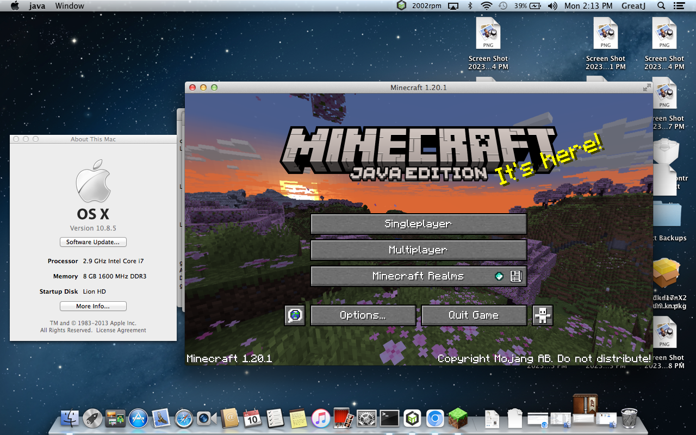

## Introduction

This project aims to supply ports of OpenJDK to versions of macOS that are no longer supported by Oracle. Currently, all legacy builds here have a minimum deployment target of 10.8.

## Available Releases
| Java Version | Release Number | Download Link | Actively Maintained | Additional Notes |
|:------------:|:--------------:|:-------------:|:-------------------:|:----------------:|
|    JDK 17    |        2       |[Github](https://github.com/Jazzzny/jdk-macos-legacy/releases/tag/jazzzny-jdk-17-2)|         YES         |  10.8 build is separate from the 10.9+ builds       |
|    JDK 11    |      N/A       |    N/A        | Planned Release     |                  |
|    JDK 8     |      N/A       |    N/A        | Planned Release     |                  |